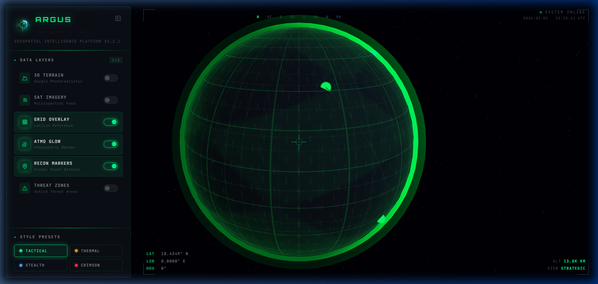
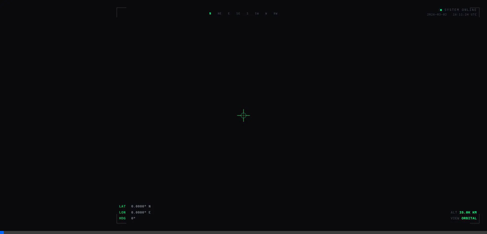
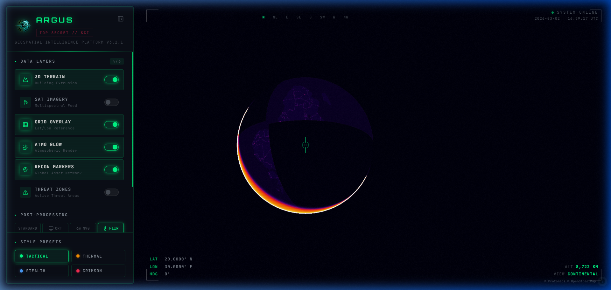

<div align="center">
  

  # 🌐 ARGUS
  ### Advanced Geospatial Intelligence Platform v3.2.1

  Modern, high-performance 3D mapping and real-time tracking application built with **React**, **MapLibre GL JS**, and **Three.js**.

  [](https://opensource.org/licenses/MIT)
  [](https://reactjs.org/)
  [](https://maplibre.org/)
  [](https://threejs.org/)

  

</div>

---

## 🚀 Overview

**ARGUS** is a web-based geospatial dashboard that visualizes real-time global object tracking (commercial flights and satellites) on top of a highly stylized, performant 3D globe. Designed to mimic top-secret defense intelligence tools, ARGUS features custom post-processing shader pipelines (CRT, Night Vision, Thermal) and specialized WebGL integrations.

--
This is Created Entirly  using AI



## ✨ Features

- 🌍 **Interactive 3D Globe**: Rendered via MapLibre GL JS v5 utilizing full sphere globe projection.
- ✈️ **Real-Time Flight Tracking**: Live aircraft data streamed from the **OpenSky Network**, rendered as dynamic heading-oriented vector arrows.
- 🛰️ **Satellite Orbits**: Live JSON TLE data ingested from **Celestrak**, mapped mathematically using `satellite.js` to draw highly accurate orbital trajectories.
- 🔍 **Detection Mode**: A tactical crosshair HUD that identifies objects on hover, showing live telemetry (Altitude, Velocity, Heading).
- 🎨 **Advanced Post-Processing Shaders**: Native full-screen fragment shaders intercept the Mapbox canvas to apply realistic screen effects:
  - 🟢 **NVG** (Night Vision Goggle) with dynamic noise.
  - 🟠 **FLIR** (Forward Looking Infrared) thermal gradient mapping.
  - 📺 **CRT** mode with scanlines, chromatic aberration, and localized vignette.
- 👁️ **Specialized WebGL Layers**:
  - **CCTV Vector Projection (Three.js):** Seamlessly extracts vector building geometries, extrudes them dynamically into 3D meshes, and UV-projects synchronized `<video>` textures across the city.
  - **GPU Traffic Simulation:** Uses raw `gl.POINTS` WebGL fragment shaders to spawn over 10,000 glowing data packets racing along local OSM road networks at a flawless 60 FPS natively avoiding React main-thread lockups.

## 🗺️ Why Protomaps? (Cost-Effective Basemaps)

ARGUS is built specifically to use **Protomaps** (PMTiles) over standard commercial tile providers (like Google Maps or Mapbox). 

Why? Extremely detailed WebGL 3D mapping applications usually incur significant API costs for vector map layers. Protomaps allows ARGUS to render stunning map tiles locally, or via immensely cheap object storage, completely bypassing API rate limitations or expensive "pay-per-view" billing schemes.

### ⚙️ Want to use Google Maps or Mapbox?
You can easily swap the MapLibre `style` URL in `src/components/MapView.jsx` to any generic stylesheet format if you possess the API keys:
```js
// Replace the internal protomaps style with a Mapbox style URL
mapStyle="mapbox://styles/mapbox/dark-v11"
```

## 📸 Media & Examples

### Tactical WebGL Visualizations
<div align="center">
  
</div>

### Thermal (FLIR) Shader Mode


### Live OpenSky Flight Tracking


## 🛠️ Installation & Setup

1. **Clone the repository:**
   ```bash
   git clone https://github.com/nishal21/ARGUS.git
   cd argus
   ```

2. **Install dependencies:**
   ```bash
   npm install
   ```

3. **Start the development server:**
   ```bash
   npm run dev
   ```

## ☁️ Auto-Publish to GitHub Pages (CI/CD)
ARGUS includes a pre-configured **GitHub Actions workflow** (`.github/workflows/deploy.yml`) that will automatically build and publish the application to GitHub Pages every time you push to the `main` branch. 

**No Landing Page Needed:** Because ARGUS is a full-screen interactive web application, it serves as its own landing page. Visitors will immediately drop into the 3D globe tactical interface.

**To Enable Auto-Publish:**
1. Go to your GitHub Repository Settings.
2. Navigate to **Pages** on the left sidebar.
3. Under **Source**, switch from "Deploy from a branch" to **"GitHub Actions"**.
4. Push your code! The workflow automatically sets the Vite base path (`--base=/ARGUS/`) to ensure none of the assets break or result in a "blank white page" error.

## 🤝 Contributing
Contributions, issues, and feature requests are welcome! 
If you want to improve the shaders, add new geospatial APIs, or optimize the WebGL layers:
1. Fork the project.
2. Create your feature branch (`git checkout -b feature/AmazingFeature`).
3. Commit your changes (`git commit -m 'Add some AmazingFeature'`).
4. Push to the branch (`git push origin feature/AmazingFeature`).
5. Open a Pull Request.

## 📡 API Endpoints & Rate Limits
ARGUS relies on public, unauthenticated APIs for the live tracking dashboard.

- **OpenSky Network:** Restricted to 400 requests per day for public users. ARGUS automatically buffers this with a 60-second fetch interval and falls back to a realistic synthetic dataset if `HTTP 429 Too Many Requests` is reached.
- **Celestrak:** Requests the current CelesTrak active satellites `.json`. Updated via a 5-minute cache to respect public CORS policies.

## 📄 License
This project is licensed under the MIT License. Use it, break it, and build cool things!

---

**Built with ❤️ by [Nishal K](https://github.com/nishal21)**
